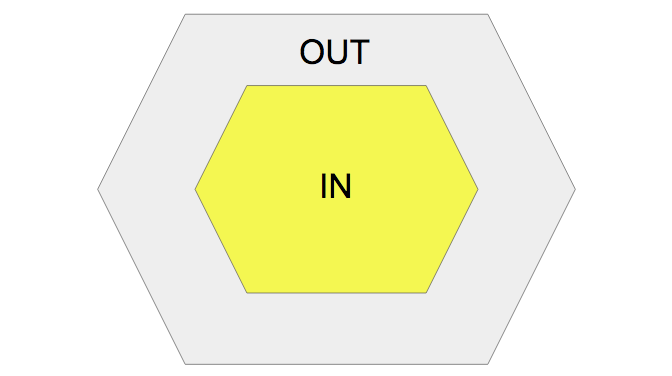
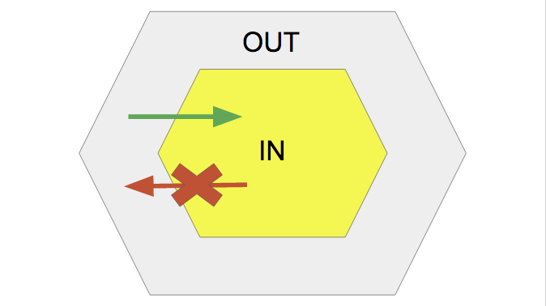
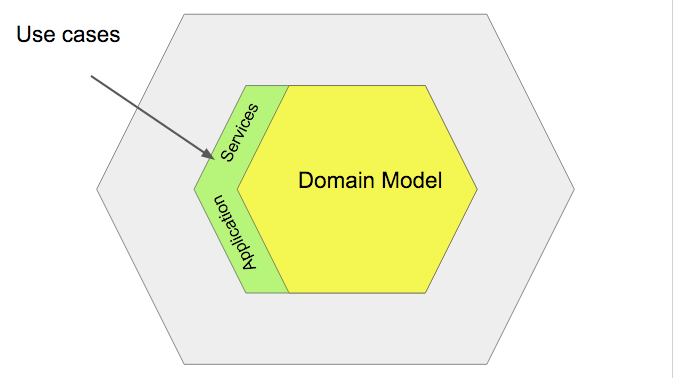
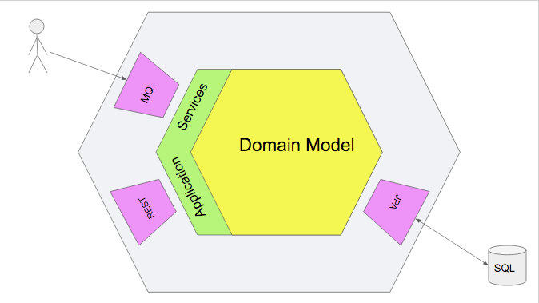

# A Gentle Introduction to Hexagonal Architecture

## Background
Frameworks are great. They help us to gain productivity, improve quality and unify practices. Because of the evolution of our needs the framework we choose today could not be the one we will need tomorrow.

Moving from a framework to another may involve a complete refactoring of the application if its architecture is not flexible enough. This is expensive, risky and often hard to justify to the business.

Application's business behaviors should not be impacted by moving from one framework to another.

## Hexagonal Architecture
The hexagonal architecture aim to isolate the more important part of our system from details.  The more important part is the business logic inside the domain model. This is the heart and the rest is just a detail. The user interface is a detail. The data persistence technology is a detail.

So the goal is to make the core of the application totally framework or library agnostic.

### Hello, (World/2)!
With the hexagonal architecture each code can be placed in only one of these two areas: "IN" and "OUT".

The code inside the "IN" area belongs to the heart of your system. It contains business logic. Anything that does not contains business code is forbidden.

The "OUT" area contains everything else than business logic. The code in this area is used to query an external system, persist data or provide interfaces in order to allow external systems/users to execute our use cases. For instance these interfaces could be a web interface, a CLI, an asynchronous interface based on a message queue system, a web service.

The most important thing to understand is the dependency direction. The code in the "OUT" can depends on some code defined in the "IN" area. However it is totally forbidden that a code belonging to the "IN" area depends on code defined outside.

This is a simple rule with big impact from a quality point of view.

Examples:
- "IN" must not depends on validation annotations
- "IN" must not depends on marshaling/unmarshaling annotations

### Application services
In an application we need a special kind of object who act as coordinator. They implement use cases by coordinating calls to the domain model. These object are application services.

They form a thin layer around the domain model. They are the only entry point to the domain model. From a rule point of view their are part in the "IN" area.

### Adapters

### Dependency inversion
Application services can depends on external service in order to complete the use cases they implement. Let's imagine that a use case need to send an email to a user in order to notify him that something interesting happened.

As previously said the application services are submitted to the same rules than the "IN" area: they must not depend on something defined in the "OUT" area.

In order to solve this problem the application layer will define a couple of interfaces describing its dependencies. The implementation of these dependencies will be in the "OUT". The dependency injection framework used by the application will do the job.

## Advantages
- Easier to stay focus on code that really matter.
- Communicate the intent and not the how
- Great tool to discuss about dependencies
- Great architecture tool
- The core is only composed by POJO who are easier to tests
-

## Guidelines
The golden rules to always keep in mind when applying the hexagonal architecture are:
* **the code in the "IN" area only contains business concerns". The other concerns must be in the "OUT" area".**

* **the code in the "IN" area must never depends on code outside its area**

### Application services
* *@Inject* annotation is allowed on the application service constructor in order to allow dependency injection container to inject dependencies. (exception of the golden rule)

* *@Transactional* annotation on the application service methods is allowed in order to mark transaction demarcation.

* Application service methods can return entities since they are transaction demarcation. (exception of the golden rule)

* Any change of an entity state outside the "IN" area must not be persisted.

* Entities are not allowed as input parameter of application service methods. Only primitive types or immutable DTOs containing primitive types are allowed.

### Validation
* The use of Java Bean Validation API (JSR330) is forbidden in the "IN" area

* The use of Java Bean Validation API (JSR330) is allowed in the "OUT" area

### Domain model
* The use of JPA mapping annotations is allowed on entities (exception of the golden rule)

### Packages structure
* *$groupId.$artificatId.application* contains all application services implementing use cases.

* *$groupId.$artificatId.domain* contains the domain model building blocks (entities, repositories, value objects, etc.).

* *$groupId.$artificatId.adapter.in* contains adapter for ports exposed by the "IN" area.
For instance: REST web services, MVC web application, etc.

* *$groupId.$artificatIdadapter.in.$adapterName* if multiple adapters for the same port exposed by the "IN" area thus a package for each adapter must be used.

* For instance persistence (repository or dao implemenations), gateways to interact with other systems, etc.

### DTOs naming convention
It could be sometimes hard to understand where and the reasons for which a DTOs is used if it is only suffixed by *Dto*. In order to have this information at first sight.

* DTOs in the *$groupId.$artificatIdadapter.in* package and all sub packages must be suffixed by *Input* if used as method parameter and *Output* if returned.

* DTOs in the *$groupId.$artificatId.adapter.out* package and all sub packages must be suffixed by *Request* if used as method parameter and *Response* if returned.

### TDD
* All application service methods must be unit tested using mocked dependencies.

## Reflections
* Conformism and DTOs hell
